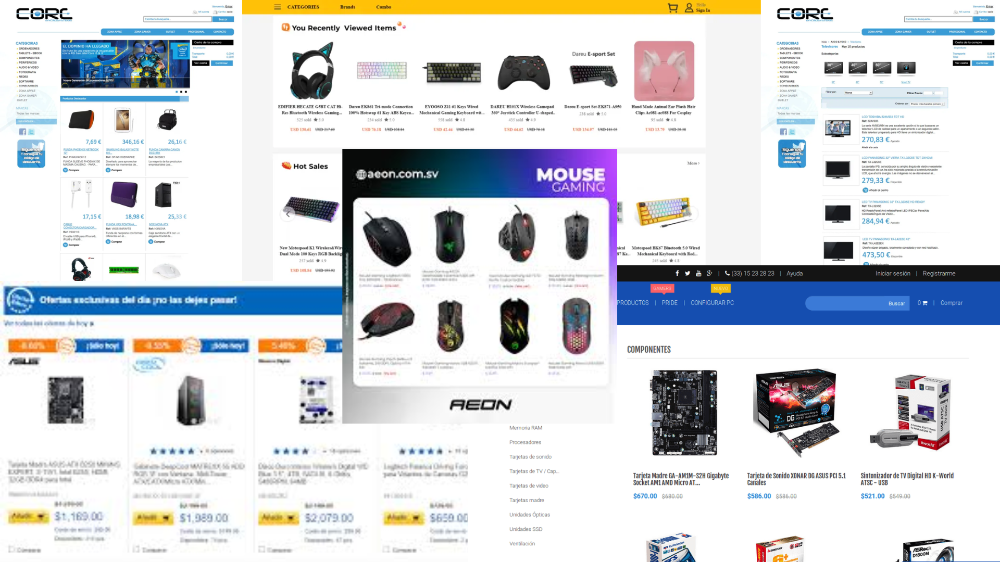
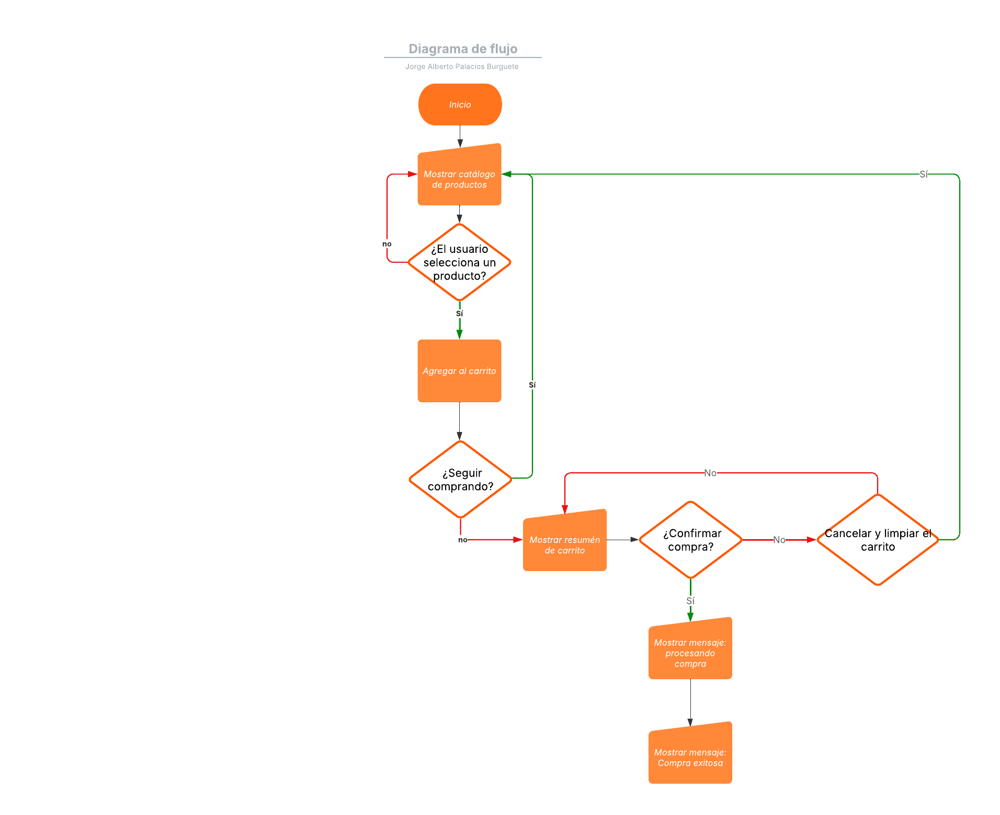

# Tienda Online: Periféricos Pro

## Nombre de tu tienda online

**True Aim**

## Descripción de tu tienda online

Periféricos Pro es una tienda especializada en la venta de periféricos para computadoras de escritorio y portátiles. Ofrecemos productos como teclados, ratones, audífonos, micrófonos, y accesorios gamers de calidad. Nuestro objetivo es ofrecer herramientas confiables y con estilo a estudiantes, profesionales y gamers que buscan mejorar su experiencia digital.

## Inventario de productos

| ID  | Nombre del producto     | Categoría  | Descripción corta                              | Precio (MXN) | Stock |
| --- | ----------------------- | ---------- | ---------------------------------------------- | ------------ | ----- |
| 001 | Teclado mecánico RGB    | Teclados   | Teclado con retroiluminación y switches azules | $950         | 30    |
| 002 | Mouse gamer 7200 DPI    | Ratones    | Ratón con 7 botones programables               | $620         | 40    |
| 003 | Audífonos con micrófono | Audio      | Sonido envolvente 7.1 con cancelación de ruido | $1,200       | 25    |
| 004 | Micrófono USB cardioide | Micrófonos | Micrófono de alta calidad para streaming       | $890         | 15    |
| 005 | Soporte de laptop       | Accesorios | Soporte ajustable y ergonómico                 | $350         | 50    |

## Moodboard

## Algoritmo del proceso de compra (lenguaje natural)

1. El usuario accede a la tienda online.
2. Explora el catálogo de productos disponibles.
3. Selecciona un producto y lo agrega al carrito.
4. Puede seguir comprando o ir al carrito.
5. En el carrito revisa su pedido y el total a pagar.
6. Si está listo, da clic en "Comprar".
7. Aparece una confirmación de la compra.
8. Se vacía el carrito y se notifica que la compra fue exitosa.

## Diagrama de flujo del proceso de compra

